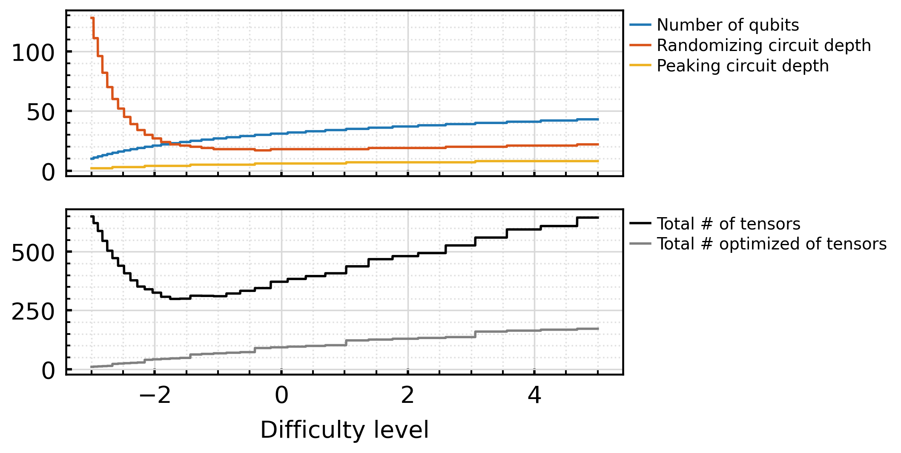

# Miner Frequently Asked Questions

## Challenge 1: Peaked Circuits

Peaked circuits are the first class of quantum circuits launched with the Quantum subnet.  These circuits, explored in depth by [Scott Aaronson](https://scholar.google.com/citations?user=EYv2BNQAAAAJ&hl=en) and [Yuxuan Zhang](https://scholar.google.com/citations?user=jf5oJUUAAAAJ&hl=en&oi=sra) in their paper "[On verifiable quantum advantage with peaked circuit sampling](https://arxiv.org/abs/2404.14493)" (arXiv:2404.14493), were a prime starting point as they allow us to hand a complex QASM to a miner, and verify their execution using a simple string.  

You can find our [technical write](https://www.qbittensorlabs.com/PeakerCircuitsTecDes.pdf) up on [qBitTensorLabs.com](https://www.qbittensorlabs.com/). 

### How often should I expect to get a circuit? 

One of the challenges of the Peaked Circuits, is that they are computationally intense to generate.  The miners are responsible for requesrting them, but the validators are reposible for generating them.  Since there is such a large number of miners and a low number of validators, there will often be long wait times for a circuit.  

The aim of the second circuit (which has not yet been announced) will be to provide a similar level of challenge to the miners with a significantly reduced workload for the validators.  

If you are a miner eager to test, and you don't want to wait, you can see the sampled circuits provided in this repo, to test.

### How big are the circuits at each difficulty level?

The number of qubits can be backed into using this formula (taken from the code):
$$
qubits = Floor(12 + 10 * log2(3.9 + {diff}))
$$

This results in the following for a number of common `diff` values:

| difficulty | qubits | RAM for State Vector (GiB) |
|------------|--------|----------------------------|
| 0.0        | 31     | 32                         |
| 0.1        | 32     | 64                         |
| 0.5        | 33     | 128                        |
| 0.7        | 34     | 256                        |
| 1.0        | 34     | 256                        |
| 1.5        | 36     | 1024                       |
| 2.0        | 37     | 2048                       |
| 2.5        | 38     | 4096                       |
| 3.0        | 39     | 8192                       |
| 3.5        | 40     | 16384                      |
| 4.0        | 41     | 32768                      |
| 4.5        | 42     | 65536                      |
| 5.0        | 43     | 131072                     |

### How many Gate Operations are there ad each diffficulty level?

The math is a bit more complicated for this, so we'll represent this visually instead.  You can see from the following plot, the number of tensors.  On average there will be ~8.5x as many operations as the number of tensors listed.  

### Where can I find Sample circuits?

We have provided  a set of sample QASM files, containing QASM that is representative of what the validators would provide for a given `diff` level.  For all 'PUBLIC' files, there will also be a JSON file with the QASM that include key parameters used when generating the circuit, along with the peaked string you are trying to solve for.

You can find these located in the [/sample_circuits/peaked_circuit/](/sample_circuits/peaked_circuit/) directory.

There is no incentive for executing these, these are simply provided to allow you to make it easy for you to develop youy custom approaches to executing these circuits outside of the network before jumping in.

### I hear that lower UIDs are favored over higher UIDs

There was a defect during our first week after launch, where this was true due to a defect.  This defect was resolved and this is no longer the case. 

### How long do I have to wait after solving a problem to receive the incentive?

Weights are set every 360 blocks + a smaller amount of time it takes for certificates to be distributed to all the validators to score you.

### Sometimes I get lower difficulty circuits than expected, after increasing my `diff` value

The Validator that you give your preferred difficulty to does not share it with other validators since this system is decentralized. You have to share that difficulty with each validator before it will be updated with each validator. This takes time, and you will receive smaller circuits until it has reached everybody.

## Circuit 2: Comming Soon